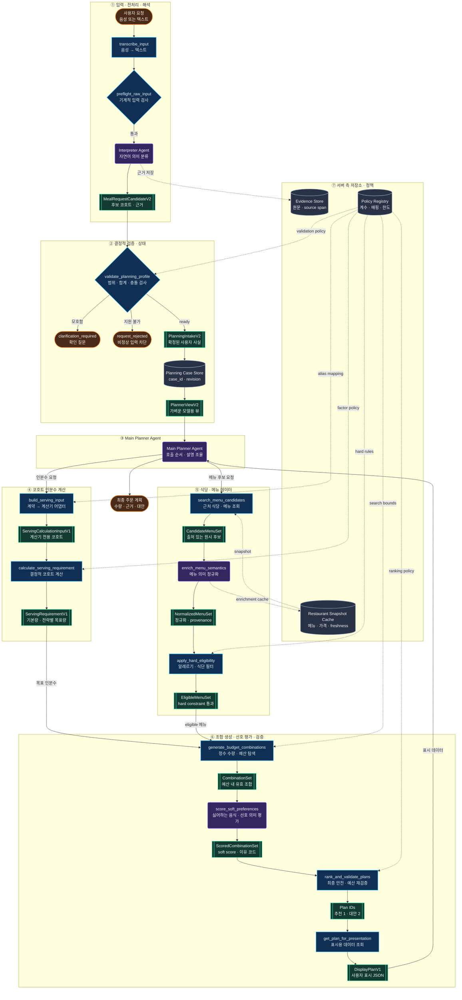

# Agent Architecture and Data Workflow

Status: implementation baseline  
Updated: 2026-08-01  
Interactive version: <https://group-food-agent-workflow.thetired3080.chatgpt.site/>

The editable diagram dataset is `workflow-site/public/data/workflow.json`. The web renderer in `workflow-site/app/workflow-diagram.tsx` loads this dataset dynamically; descriptions must remain in the dataset rather than being duplicated in UI code.

## Full Workflow

## Trust and Computation Boundaries

| Category | Components | Rule |
| --- | --- | --- |
| AI agents | Interpreter, Main Planner, menu enrichment, soft-preference scoring | Interpret variable language, orchestrate, or explain; emit schema-validated structured output. |
| Deterministic functions | Preflight, profile validator, serving adapter/calculator, search adapter, hard eligibility, combination search, final validation | Own ranges, arithmetic, hard constraints, policy, bounds, and reproducibility. |
| Data artifacts | Candidate, intake, calculator input/output, menu sets, combination sets, plan IDs, display plan | Immutable/versioned stage boundaries; large artifacts remain server-side. |
| Stores | Planning Case Store, Restaurant Snapshot Cache, Evidence Store, Policy Registry | Not injected wholesale into prompts; tools retrieve only what a stage needs. |
| Terminal outcomes | Clarification, rejection, final plan | Controlled user-visible outcomes; no forced plan for invalid or impossible input. |

## Tool Arguments and Artifact IDs

| Tool or agent-as-tool | Inputs | Why anything beyond `case_id` is passed |
| --- | --- | --- |
| `build_serving_input` | `case_id` | The current case revision uniquely selects the validated profile and policy. |
| `calculate_serving_requirement` | `case_id` or `serving_calculation_input_id` | Pass the artifact ID when adapter outputs are versioned, compared, or retried. |
| `search_menu_candidates` | `case_id` | Location, categories, budget context, and snapshot policy resolve from the case. |
| `enrich_menu_semantics` | `case_id`, `candidate_set_id` | A case may have several searches/refreshes; the ID prevents enriching the wrong set. |
| `apply_hard_eligibility` | `case_id`, `menu_set_id` | It combines case-specific restrictions with one exact normalized menu version. |
| `generate_budget_combinations` | `case_id`, `eligible_set_id`, `serving_requirement_id` | It must join an exact eligible-menu branch with an exact demand calculation. |
| `score_soft_preferences` | `case_id`, `combination_set_id` | It scores one bounded candidate set against the case's semantic preferences. |
| `rank_and_validate_plans` | `case_id`, `scored_set_id` | Final checks must run on the exact scored version and current case revision. |
| `get_plan_for_presentation` | `case_id`, `plan_ids` | Only selected plans cross into the explanation prompt; the full search space stays server-side. |

Tools sharing `case_id` all need the current immutable user profile, policy version, and trace context. Tools receiving an additional artifact ID are consumers of a branchable/versioned intermediate result. This keeps tool prompts small and prevents accidental mixing of stale calculation and menu branches.

## Serving Adapter Boundary

`build_serving_input` is the compatibility seam between `PlanningJobV2` and the teammate's existing cohort calculator.

It must:

- Map contract appetite vocabulary to the existing calculator keys.
- Map `late_night` to `late_night_snack` and `minimize_shortage` to `avoid_shortage`.
- Expand only mutually exclusive validated cohorts, never one object per person unless needed.
- Preserve counts and exact explicit custom serving values.
- Apply calculator adjustment codes only when unambiguously supported.
- Detect mutually exclusive adjustments and flag potential double counting.
- Produce a calculator-only `ServingCalculationInputV1`; do not mutate `PlanningIntakeV2`.
- Record adapter version, serving policy ID, applied aliases, skipped adjustments, warnings, and assumptions.

The deterministic formula remains:

`cohort demand = cohort count × appetite factor × meal factor × accepted adjustment factors`

`group base demand = sum(cohort demand)`

`strategy target = capped group base demand × configured margin`

Use `Decimal` throughout calculation and convert to milli-servings at the defined output boundary. Never use binary floating point for business arithmetic.

## Replanning

Replan from the earliest affected artifact:

| Change | Earliest stage to rerun |
| --- | --- |
| Participant count, appetite, activity, recent meal, meal type | Profile validation, then serving adapter/calculation and all downstream stages. |
| Allergy, diet, strong exclusion | Profile validation, hard eligibility, combinations, scoring, and final validation. |
| Budget or shortage/leftover objective | Combination generation and downstream stages; serving strategy target may also change. |
| Restaurant/menu availability or serving evidence | Search/normalized menu set, eligibility, combinations, and downstream stages. |
| Soft dislike/preference only | Soft-preference scoring and downstream stages if the eligible/menu sets are unchanged. |
| Presentation wording only | Presentation retrieval/explanation only. |

Every artifact is tied to `case_id`, `profile_revision`, policy IDs, and upstream artifact IDs so stale branches can be rejected deterministically.

## Diagram Maintenance

To change the public diagram:

1. Edit `workflow-site/public/data/workflow.json`.
2. Keep node IDs stable when semantics do not change.
3. Validate that every group node ID and edge endpoint exists.
4. Run the diagram site's tests and production build.
5. Redeploy the nested `workflow-site` project.

The renderer already supports hover, click-to-pin, keyboard focus, and dataset-driven descriptions. Do not restore reliance on Mermaid-generated SVG IDs; they are not a stable API.
