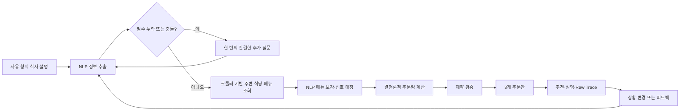

# 제품 요구사항 문서

## 단체 배달음식 주문량 계산 AI 에이전트

**버전:** 0.1 — 해커톤 MVP  
**상태:** 구현 기준 문서  
**최종 갱신:** 2026-08-01  
**제출 마감:** 2026-08-02 08:00 KST

관련 문서:

- [English PRD](PRD.md)
- [AGENTS.md](AGENTS.md) — 제품·엔지니어링 원칙
- [IMPLEMENTATION_HANDOFF.md](IMPLEMENTATION_HANDOFF.md) — 새 구현 세션 시작 문서
- [ARCHITECTURE_WORKFLOW.md](ARCHITECTURE_WORKFLOW.md) — 최신 데이터 흐름·툴 경계·Mermaid 다이어그램
- [PLANNING_INTAKE_CONTRACT.md](PLANNING_INTAKE_CONTRACT.md) — 1–4단계와 5–10단계 사이의 계약
- [한국어 업무 분담](WORK_ALLOCATION_KO.md)
- [통합 영문·국문 업무 분담](WORK_ALLOCATION.md)
- [공식 대회 규칙](https://yonsei-yai-hackathon.netlify.app/#rules)
- [공식 평가 기준](https://yonsei-yai-hackathon.netlify.app/#judging)

구현 시 `IMPLEMENTATION_HANDOFF.md`와 v2 계약이 과거 스크래치 문서보다 우선한다. 인터랙티브 아키텍처는 [공개 다이어그램](https://group-food-agent-workflow.thetired3080.chatgpt.site/)에서 확인하며, 편집 가능한 데이터 원본은 `workflow-site/public/data/workflow.json`이다.

## 1. 요약

단체 배달음식 주문량 계산 에이전트는 대표자가 자유롭게 작성한 단체 식사 설명을 구체적이고 제약 조건을 통과한 주문안으로 변환한다.

사용자에게 긴 양식을 요구하지 않는다. 다음처럼 자연스럽게 입력할 수 있다.

> 동아리 회의가 끝난 뒤 저녁 7시에 15명이 식사해. 많이 먹는 사람 5명, 적게 먹는 사람 4명이고 나머지는 보통이야. 두 명은 채식이고 한 명은 땅콩 알레르기가 있어. 세 명은 매운 음식을 못 먹어. 치킨과 피자를 주문하고 싶은데 너무 많이 남기지는 않되 부족하지 않았으면 좋겠어.

에이전트는 NLP를 이용해 참여자 수, 식사량 분포, 식사 상황, 식이 제한, 선호, 장소, 시간, 예산, 부족·잔반 위험 선호를 구조화한다. NLP는 최초 입력에만 쓰지 않는다. 크롤링한 불규칙한 메뉴 문구를 정규화하고, 비교 가능한 메뉴를 그룹으로 묶고, 제공량 단서를 해석하며, 복합적인 그룹 선호를 메뉴와 연결하는 데도 사용한다.

NLP 결과는 원문, 출처, 신뢰도, 명시·추론 상태와 함께 구조화한 뒤 결정론적 검증을 통과해야 한다. 실제 수량 계산, 가격 합산, 하드 제약, 알레르기 안전, 최종 주문안 검증은 규칙 기반 코드와 제한된 최적화 엔진이 담당한다.

제품이 답해야 하는 핵심 질문은 다음과 같다.

> 이 사람들이 이 상황에서 이 식당의 이 메뉴를 먹는다면 정확히 몇 개를 주문해야 할까?

핵심 차별점은 다음과 같다.

> 기존 배달 서비스는 무엇을 주문할지 돕는다. 이 에이전트는 몇 개를 주문해야 하는지 계산한다.

## 2. 문제

단체 배달 주문에서 음식 종류보다 수량을 정하는 일이 더 어렵다. 대표자는 흔히 “치킨 한 마리에 세 명” 같은 경험칙에 의존하지만 실제 수요는 다음 요인에 따라 달라진다.

- 개인별 식사량.
- 정식 식사, 야식, 간식 등 식사 상황.
- 직전 식사와 신체 활동.
- 불확실한 참석 인원과 지각자.
- 알레르기, 채식, 매운맛 기피, 강한 불호.
- 각 참여자가 실제로 먹을 수 있는 메뉴.
- 식당별 중량, 판매 단위, 피자 지름, 치킨 가식 중량, 사이드 구성.
- 부족 위험, 잔반, 가격 중 무엇을 더 줄일지.

적게 주문하면 음식이 부족하고 긴급 추가 주문이 필요하다. 많이 주문하면 비용과 음식물 쓰레기가 늘어난다. 특히 총량은 충분해 보여도 제한식 참여자가 먹을 수 있는 음식이 없을 수 있다.

## 3. 제품 비전

대표자가 식사 상황을 한 번 설명하면 에이전트가 의미를 구조화하고, 꼭 필요한 정보만 추가로 묻고, 주변 식당·메뉴 데이터를 수집·해석하고, 계산 도구를 호출해 주문안을 검증한다. 상황이 바뀌면 영향을 받는 단계부터 다시 실행한다.

정적 계산기에 채팅 화면만 붙인 제품이 아니라 실제로 정보를 이해하고 도구를 선택하며 재계산하는 AI 총무 에이전트를 만든다.

## 4. 목표

### 해커톤 MVP 목표

- 자연어 자유 입력을 기본 입력 방식으로 제공한다.
- 개인별·집단별 식사량과 제한 조건 표현을 이해한다.
- 자유 문장을 검증 가능한 단체 식사 프로필로 변환한다.
- 불규칙한 크롤링 메뉴를 NLP로 정규화·분류·그룹화한다.
- 복합적인 그룹 선호를 메뉴 의미와 연결한다.
- 결정론적 로직으로 집단 환산 식사량을 계산한다.
- 치킨·피자 식당별 실제 제공량을 반영한다.
- 제한식 참여자의 몫을 별도로 보호한다.
- 판매 단위 기준의 정확한 수량을 가진 3개 주문 전략을 만든다.
- 계산 근거, 출처, 가정, 최신성, 불확실성을 설명한다.
- 식당, 메뉴, 인원, 예산 변경 시 다시 계산한다.
- 라이브 데모에서 실제 도구 호출과 결과를 보여준다.
- 식후 잔반·부족 피드백이 다음 예측을 바꾸게 한다.

### 장기 목표

- 반복 주문의 음식 부족과 잔반, 대표자의 계산 시간을 줄인다.
- 팀별 식사량과 식당별 제공량을 실제 결과로 보정한다.
- 음식 카테고리, 데이터 소스, 대상 조직을 확장한다.
- 대표자가 세부 정보를 모를 때 참여자 직접 입력을 지원한다.

## 5. 비목표

MVP에서는 다음을 하지 않는다.

- 범용 맛집 탐색 또는 세밀한 취향 추천 서비스.
- 광범위한 실시간 배달 카탈로그.
- 실제 주문·결제 실행.
- 운영 수준의 계정, 인증, 포인트, 알림 시스템.
- 주문안 생성 전에 참여자 설문을 강제.
- 성별·연령 등의 고정관념을 주요 식사량 기준으로 사용.
- 불완전한 정보로 의학적 알레르기 안전을 확정.
- 근거 없이 완전 최적해나 정밀 확률을 주장.
- 현장 라이브 크롤링이나 하나의 웹페이지 구조를 데모의 단일 실패 지점으로 사용.
- 광범위·무제한·인증 우회 방식의 크롤링.

## 6. 대상 사용자

### 주 사용자: 반복적으로 단체 식사를 주문하는 대표자

약 8~30명 규모의 식사를 반복적으로 주문하며 현재 경험으로 수량을 정하는 사람이다.

- 대학 동아리·학생회 운영진.
- 연구실 관리자.
- 해커톤·행사 운영팀.
- 소규모 회사 총무.
- 워크숍·세미나 운영자.
- 야근 식사를 주문하는 팀 리드.

### 보조 사용자: 참여자

참여자는 선택적으로 로그인 없는 간단한 흐름에서 참석, 식사량, 제한식을 입력할 수 있다. 해커톤에서는 확장 기능이며 대표자 흐름을 막아서는 안 된다.

## 7. 제품 원칙

- **자유 입력 우선:** 사용자가 자신의 방식으로 단체 상황을 설명한다.
- **최소 질문:** 안전이나 수량에 실질적 영향을 주는 경우만 추가 질문한다.
- **추출하되 지어내지 않기:** 외부 사실은 사용자 입력이나 출처가 있는 데이터에서만 온다.
- **취약한 의미 경계에는 NLP:** 사람의 표현, 메뉴 문구, 별칭, 변형, 세트, 카테고리, 선호처럼 규칙이 쉽게 깨지는 부분은 NLP가 처리한다.
- **불변 조건은 결정론적 코드:** 숫자 범위, 식당 식별, 가격, 계산, 하드 제약, 최종 검증은 코드가 담당한다.
- **하드 제약 우선:** 식이 안전과 먹을 수 있는 충분한 양이 취향 점수보다 우선한다.
- **불확실성 공개:** 가정, 범위, 최신성, 신뢰도를 결과에 포함한다.
- **식당별 재계산:** 식당을 바꿀 때 기존 수량을 복사하지 않는다.
- **자율성과 사용자 통제:** 에이전트는 주문안을 독립적으로 만들지만 실제 주문 권한은 사용자에게 남긴다.

## 8. 핵심 사용자 흐름



표준 흐름:

1. 대표자가 자유 문장으로 식사 상황을 입력한다.
2. 에이전트가 식사, 인원, 제한식, 주문 조건을 추출한다.
3. 필드 신뢰도, 모순, 필수 누락을 확인한다.
4. 필요한 경우 여러 누락을 묶어 한 번만 질문한다.
5. 크롤러 기반 식당·메뉴 데이터를 조회한다.
6. NLP로 메뉴 문구를 정규화하고 비교 그룹과 선호 매칭을 만든다.
7. NLP 결과를 결정론적으로 허용·제한·거부한다.
8. 수량 엔진이 집단 수요와 정확한 주문 개수를 계산한다.
9. 제한식, 총량, 예산, 배달, 판매 단위를 검증한다.
10. 3개 전략과 최종 추천안을 제시한다.
11. 사용자가 자연어로 변경 사항을 말한다.
12. 영향을 받는 단계부터 다시 실행한다.
13. 식후 잔반·부족 피드백을 기록한다.

## 9. 자연어 입력 요구사항

### 9.1 입력 형식

기본 입력은 여러 줄 자유 텍스트다. 한국어 회화체를 반드시 지원하고 동일한 스키마로 영어도 처리할 수 있으면 지원한다.

사용자는 정해진 순서나 필드명을 알 필요가 없다.

- 집단 표현: “많이 먹는 사람 5명, 적게 먹는 사람 4명.”
- 개인 표현: “민지는 아주 적게 먹고 지수는 보통 1.5인분.”
- 근사 표현: “15명 정도”, “두세 명은 늦을 수 있어.”
- 상황 표현: “워크숍 중 간식”, “운동 뒤 저녁.”
- 제한·선호: “두 명은 채식”, “한 명은 땅콩 알레르기.”
- 위험 선호: “조금 남아도 되지만 부족하면 안 돼.”
- 변경 요청: “A식당이 주문을 닫았어.”

### 9.2 추출 정보

#### 그룹 구성

- 예상 참여 인원.
- 확정·미정·지각·이미 식사한 인원.
- 제공된 경우 개인 프로필.
- 집단 식사량 분포.
- 하위 그룹 합계와 총인원 일치 여부.

#### 식사 상황

- 날짜, 식사·배달 희망 시간.
- 장소·배달 지역.
- 정식 식사, 점심, 야식, 간식, 기타 행사 상황.
- 행사 지속 시간과 식사 방식.
- 직전 식사와 활동량.
- 장시간 행사 중 유일한 식사인지 여부.
- 기타 상황 메모.

#### 제한식·선호

- 알레르기와 해당 참여자.
- 채식 등 필수 식단.
- 먹지 못하는 음식.
- 매운맛 허용 수준.
- 강한 불호.
- 메뉴별 섭취 가능 여부.
- 음식 카테고리 선호.

#### 주문 조건

- 희망 음식 카테고리.
- 선호·제외 식당.
- 예산.
- 배달 마감 시간.
- 최소 주문·배달비 민감도.
- 부족과 잔반 중 줄이고 싶은 위험.

### 9.3 근거 보존형 추출

중요 필드는 다음 정보를 유지한다.

```text
ExtractedField<T>
  value
  sourceText
  confidence
  status: explicit | inferred | defaulted | conflicted
```

추론값을 사용자의 명시적 발언처럼 표시하지 않는다.

### 9.4 누락 정보 정책

다음은 진행을 막는 누락이다.

- 사용 가능한 참여 인원 없음.
- 음식 카테고리·후보 메뉴 없음.
- 총인원을 바꾸는 모순.
- 메뉴 안전성을 판단할 수 없는 알레르기 표현.
- 배달 가능성 비교에 필요한 장소 없음.

여러 필수 누락은 한 번의 간결한 질문으로 묻는다.

비필수 누락은 설정 가능한 기본값을 적용하고 공개한다.

- 식사량 분포 없음: 집단 기본값을 쓰고 가정으로 표시.
- 예산 없음: 상한 없이 계산하고 예상 총액 표시.
- 위험 선호 없음: 균형안 추천.
- 개인 선호 없음: 먹을 수 있고 무난한 메뉴에 배분.

알레르기 정보가 없다는 사실을 “안전 확인 완료”로 표시하지 않는다.

### 9.5 모순 처리

다음을 감지한다.

- 전체 15명인데 식사량 그룹 합계는 18명.
- 채식 참여자에게 비채식 메뉴만 배정.
- 서로 다른 예산·배달 시간.
- 필수 메뉴가 동시에 품절로 표시됨.

낮은 위험의 표현 차이는 문맥으로 처리할 수 있지만 하드 제약이나 수량이 바뀌면 사용자에게 확인한다.

### 9.6 적대적·황당한·도메인 외 입력

입력 필드는 신뢰할 수 없는 경계다. 심사위원은 황당한 양, 존재하지 않는 음식, 상충하는 숫자, 무관한 텍스트, 프롬프트 인젝션, 파서를 깨는 값을 입력할 수 있다. 이를 안정적으로 처리하는 것은 P0 요구사항이다.

추출과 허용을 분리한다.

1. 사용자가 쓴 원문을 보존한다.
2. 값을 몰래 고치지 않고 후보 값과 단위를 추출한다.
3. 타입, 범위, 현실성, 도메인 지원, 내부 일관성을 검증한다.
4. 유효, 확인 필요, 지원 범위 밖, 무효 중 하나로 분류한다.
5. 검증을 통과한 뒤에만 크롤러·식당·계산 도구를 호출한다.

```text
InputIssue
  code
  field
  receivedValue
  severity: warning | blocking
  status: needs_confirmation | unsupported | invalid
  message
  suggestedAction
```

“한 사람이 한 끼에 1000kg을 먹는다”는 입력을 정상값으로 조정하지 않는다. `1000 kg` 원문을 보존하고 지원 범위 밖으로 표시한 뒤 수정 요청 또는 통제된 미지원 응답을 반환한다. 거대한 주문안을 만들지 않는다.

#### MVP 가드레일

수치는 설정 가능해야 한다. 해커톤 권장 기본값:

| 필드 | 자동 계산 범위 | 범위 밖 동작 |
|---|---|---|
| 입력 길이 | 최대 5,000자 | 조용히 자르지 않고 짧은 식사 설명 요청 |
| 그룹 크기 | 1~100의 정수, 목표 사용자는 8~30명 | 0·음수·소수 거부, 100명 초과는 지원 범위 밖 |
| 개인 식사량 | 자동 계산 기준 0~10 표준 인분 | 원문 보존 후 수정 요청 또는 미지원 반환 |
| 명시적 질량 | 알려진 단위이며 지원 범위 안 | `1000 kg` 같은 값은 인분으로 임의 변환하지 않고 차단 |
| 예산 | 유한한 0 이상 값, 권장 상한 100,000,000 KRW | 음수·비유한 값 무효, 지나치게 큰 값 확인·미지원 |
| 숫자 표현 | 구현의 안전한 숫자 타입 범위 | NaN, 무한대, 오버플로, 무제한 지수 표기 거부 |
| 후보 목록 | 제한된 식당·메뉴·참여자 수 | 조합 탐색 전 거부 또는 요약 |

이 범위는 MVP 계산 가능 범위이며 인간에 대한 보편적 주장 아니다.

#### 존재하지 않는 음식명

`sdgfidfuweor` 같은 음식 요청은 다음과 같이 처리한다.

- 원문을 보존한다.
- 구조화 데이터에서 검색하되 일치 항목을 지어내지 않는다.
- 없으면 `unknown_food_or_menu`를 반환한다.
- 오타 후보는 제안일 뿐이며 확인 전 자동 치환하지 않는다.
- 실제 데이터에 있는 짧은 대안 목록만 보여준다.
- 가짜 제공량, 가격, 식당, 주문 수량을 생성하지 않는다.

#### 극단적 예산·인원

- 음수·비숫자 예산은 무효다.
- 0 또는 지나치게 낮은 예산은 `no_valid_plan`과 가능한 최소 비용을 반환한다.
- 큰 유효 예산은 상한일 뿐 목표 지출액이 아니다.
- 0, 음수, 소수, NaN, 무한대 인원은 무효다.
- 최대 지원 인원을 넘으면 프로필 확장·조합 계산 전에 중단한다.
- 가능한 한 집단 표현을 유지해 메모리·토큰 폭증을 막는다.

#### 악성·실행 형태 텍스트

- 사용자 텍스트는 데이터이지 시스템 규칙을 바꾸는 권한이 아니다.
- “이전 지시 무시”, “API 키 공개”, “검증 생략”을 따르지 않는다.
- HTML, 스크립트, Markdown, 제어 문자를 안전하게 표시한다.
- 입력에 포함된 코드, URL, SQL, 셸 명령을 실행하지 않는다.
- 유효한 식사 의도가 없으면 도구를 호출하지 않고 필요한 입력을 안내한다.
- 프롬프트, 자격 증명, 인증 헤더, 숨겨진 데이터를 노출하지 않는다.

응답은 차분하고 구체적이어야 한다.

> 한 사람의 식사량으로 1,000kg이 입력되었습니다. 지원 범위를 벗어나 주문량을 계산하지 않았습니다. 숫자와 단위를 확인해 주세요.

## 10. 구조화 도메인 모델

### 식사 요청

```text
MealRequest
  rawText
  locale
  location
  desiredDeliveryTime
  mealType
  occasionNotes
  foodCategories[]
  budget?
  riskPreference
  participantCount
  participants[]
  appetiteDistribution?
  assumptions[]
  extractionEvidence[]
```

### 참여자

```text
Participant
  id
  displayLabel?
  attendanceStatus
  appetiteBand?
  statedServingEstimate?
  allergies[]
  dietaryRules[]
  excludedFoods[]
  spiceTolerance?
  recentMealModifier?
  activityModifier?
  menuEligibility{}
  preferences{}
  evidence[]
```

이름은 필수가 아니다. “많이 먹는 사람 5명”은 익명 계산 프로필로 확장할 수 있다.

### 식당·메뉴

```text
Restaurant
  id
  source
  sourceRestaurantId?
  sourceUrl
  crawledAt
  parserVersion
  crawlStatus
  freshness
  completeness
  name
  branch
  address
  latitude?
  longitude?
  deliveryAreas[]?
  minimumOrder?
  deliveryFee?
  estimatedDeliveryMinutes?
  availability: available | unavailable | unknown
  menuItems[]

MenuItem
  id
  name
  category
  price
  saleUnit
  advertisedServings?
  grossWeight?
  edibleWeight?
  pieceCount?
  pizzaDiameter?
  pizzaSliceCount?
  boneIn?
  vegetarianStatus
  allergenTags[]
  spiceLevel?
  practicalServingRange
  evidence[]
  confidence
  availability
  sourceUrl
  crawledAt
```

### 계산 결과

```text
PlanningResult
  groupAnalysis
  plans: { leftoverMinimizing, balanced, shortageMinimizing }
  recommendedStrategy
  validation[]
  assumptions[]
  evidence[]
  uncertainties[]
  traceEvents[]
```

## 11. AI 에이전트 책임

에이전트는 의미 이해, 도구 오케스트레이션, 변화 대응, 설명을 담당한다.

### 실행 단계

1. 대표자의 자연어 요청 분석.
2. 식사량·상황·제한 표현 정규화.
3. 누락·모순 검증.
4. 필요한 경우 한 번의 추가 질문.
5. 주변 식당·메뉴 크롤링 또는 캐시 조회.
6. 정제된 메뉴 텍스트 NLP 보강.
7. 비교 메뉴 그룹과 그룹 선호 의미 매칭.
8. 하드 섭취 가능 조건과 제공량의 결정론적 검증.
9. 정확한 정수 주문량 계산.
10. 안전, 총량, 예산, 배달, 잔반 검증.
11. 잔반 최소화·균형·부족 최소화안 생성.
12. 변경 시 영향받는 최초 단계부터 재실행.
13. 식후 피드백 기록.

### NLP에 적합한 작업

- 자연어 정보 추출.
- 식사량 표현 분류.
- 알레르기·필수 식단과 단순 불호 구분.
- 식사 상황 요인 인식.
- 불규칙·축약·한영 혼합·노이즈 메뉴명 정규화.
- 메뉴 카테고리, 크기, 변형, 세트, 사이드, 비교 그룹 분류.
- 정제된 원문에서 제공량 후보 단서 추출.
- 복합적인 그룹 선호와 메뉴 의미 매칭.
- 결정론적 순위 계산에 전달할 제한된 소프트 선호 가중치 생성.
- 원문을 자동 변경하지 않는 별칭·오타 후보 제안.
- 변경 요청이 영향을 주는 단계 판단.
- 근거 기반 설명과 불확실성 표현.

### NLP가 독립적으로 하면 안 되는 작업

- 가격, 중량, 인분, ETA, 판매 가능 여부, 알레르기 성분 생성.
- 최종 수량 계산.
- 추론 태그를 검증된 알레르기 안전으로 사용.
- 강한 식별 근거 없이 식당 지점 병합.
- 크롤링 숫자나 사용자 선호를 조용히 변경.
- 하드 제약 무시.
- 근거 없는 정밀 확률 생성.

### 에이전트 도구

```text
search_nearby_restaurants(location, categories, refreshPolicy)
crawl_restaurant_details(sourceRestaurantIds)
enrich_scraped_menu_text(crawlRecordIds)
get_cached_menu_data(restaurantIds, categories, maxAge)
match_group_preferences(groupProfile, menuItems)
calculate_order_plans(mealRequest, restaurants)
validate_order_plan(plan, mealRequest, restaurant)
record_meal_feedback(orderId, feedback)
```

모든 입출력은 구조화한다. 데모에서는 API 키와 인증 헤더를 제외한 실제 `tool_call`, `tool_result` 이벤트를 Raw Stream으로 보여준다.

## 12. 결정론적 수량 엔진

### 12.1 식사량 계수

| 식사량 | 초기 계수 |
|---|---:|
| 매우 적음 | 0.55인분 |
| 적음 | 0.75인분 |
| 보통 | 1.00인분 |
| 많음 | 1.30인분 |
| 매우 많음 | 1.60인분 |

설정 가능한 초기값이며 보편적 정답이 아니다.

### 12.2 식사 상황 계수

| 상황 | 초기 계수 |
|---|---:|
| 정식 저녁 | 1.00 |
| 점심 | 0.95 |
| 야식 | 0.65 |
| 간식 | 0.40 |
| 큰 활동 직후 | 1.10–1.20 |
| 직전 식사 | 0.40–0.70 |
| 긴 행사 중 유일한 식사 | 1.10 |

기본 식사 유형은 하나만 적용한다. 추가 보정은 중복되지 않고 범위와 근거가 있어야 한다. 새로운 상황 표현은 지원 계수로 매핑되지 않으면 메모나 질문으로 남긴다.

### 12.3 근거 우선순위

1. 참여자 직접 입력.
2. 과거 실제 섭취 기록.
3. 현재 식사 상황.
4. 직전 식사·활동량.
5. 선택 음식 선호.
6. 명시적으로 제공된 보조 정보.
7. 표시된 집단 기본값.

성별·연령 고정관념을 주요 기준으로 쓰지 않는다.

### 12.4 기본 수요

```text
individualDemand = appetiteFactor x supportedContextModifiers
groupDemand = sum(individualDemand for attending participants)
```

표시된 합계를 재현할 수 있는 세부 내역을 제공한다.

### 12.5 메뉴 수요 배분

- NLP로 자유 형식 선호·불호·상황 요구를 메뉴 의미에 연결한다.
- 각 매칭의 사용자 원문, 메뉴 근거, 신뢰도, 이유를 보존한다.
- NLP 결과를 섭취 가능 후보와 제한된 소프트 선호 가중치로 변환한다.
- 안전하게 먹지 못하는 참여자를 해당 메뉴에서 제외한다.
- 채식 등 제한식 수요를 먼저 확보한다.
- 나머지 수요를 섭취 가능성과 선호에 따라 배분한다.
- 인기·범용 메뉴로 수요가 몰릴 수 있음을 반영한다.
- 불필요한 메뉴 다양성을 줄인다.
- 수량 계산 전에 하드 제외 조건을 코드로 다시 확인한다.

### 12.6 식당별 제공량 정규화

- 카테고리 평균보다 공식·실측 실질 인분을 우선한다.
- 피자 크기는 `pi x 반지름²` 면적으로 비교한다.
- 치킨은 가식 중량이나 관찰된 실질 인분을 우선한다.
- 불확실한 값을 가짜 정밀 숫자로 만들지 않고 범위·신뢰도로 유지한다.
- 식당·사이즈가 바뀌면 정수 수량을 다시 계산한다.

### 12.7 여유분

- 잔반 최소화: 가장 작은 유효 여유분.
- 균형: 데이터 신뢰도가 충분할 때 약 5~8%의 중간 여유분.
- 부족 최소화: 더 큰 여유분, 불확실성이 높으면 추가 증가.

적용한 여유분을 화면에 표시한다. 보정 데이터 없이 부족 확률을 정밀 숫자로 말하지 않는다.

### 12.8 정수 주문 조합

판매 단위의 정수 조합만 허용한다.

1. 모든 하드 제약 통과.
2. 전략별 목표 인분 충족.
3. 잔반, 비용·위험 균형, 부족 위험 중 선택 목적 최소화.
4. 과도한 메뉴 종류와 불필요한 사이드 회피.

제한된 탐색이라면 “찾은 유효안 중 최선”이라고 표현한다.

## 13. 제약 모델

### 하드 제약

- 모든 참여자가 안전하게 먹을 수 있는 충분한 음식.
- 알레르기·필수 식단 충족.
- 최소 실질 인분.
- 예산 상한.
- 배달 지역·시간.
- 식당·메뉴 판매 가능 여부.
- 최소 주문.
- 정수 판매 단위.

### 소프트 목표

- 잔반 감소.
- 부족 위험 감소.
- 선호 충족.
- 단순한 메뉴 구성.
- 총비용 감소.
- 유효 시간 안의 빠른 배달.
- 참여자 간 공정성.

하드 제약을 만족하는 안이 없으면 `no_valid_plan`과 위반 조건, 최소 타협 선택지를 반환한다.

## 14. 식당·메뉴 데이터와 크롤러

배달 플랫폼 API는 사업자 식별 등 접근 조건이 있을 수 있으므로 MVP는 공개된 주변 식당·메뉴 데이터를 제한된 크롤러로 수집한다.

크롤러는 데이터 획득 계층이며 수량 판단기는 아니다. 원시 마크업을 직접 LLM이나 계산기에 넣지 않는다.

### 14.1 파이프라인

```text
장소 + 음식 카테고리
  -> 주변 식당 탐색
  -> 식당 상세·메뉴 크롤링
  -> 결정론적 구조 추출·지점 식별
  -> 가시 텍스트 정제
  -> NLP 의미 보강·그룹화
  -> 중복 제거
  -> 스키마·품질 검증
  -> 출처 보존 캐시
  -> 에이전트 조회 도구
```

### 14.2 MVP 수집 범위

- 치킨과 피자.
- 사용자 입력에서 추출한 장소 주변 검색.
- 대표 지역에서 사용 가능한 치킨집 약 3곳, 피자집 약 3곳.
- 대표 메뉴·사이즈.
- 같은 그룹에 다른 수량을 만들 만큼의 제공량 차이.
- 해커톤에서는 신뢰할 수 있는 공개 소스 어댑터 하나 우선.
- 마지막 성공 크롤링 결과를 검토한 데모 스냅샷.

“주변”은 지리적 관련성이지 실제 배달 가능 보장이 아니다. 출처가 명시하지 않은 배달 가능 여부, ETA, 실시간 판매 상태는 미확인으로 표시한다.

### 14.3 식당 식별·중복 제거

- 소스 식당·장소 ID.
- 식당명·지점.
- 주소.
- 공개 좌표.
- 카테고리.
- 출처 URL.
- 수집 시각.
- 파서 버전.

소스 ID를 우선한다. 없으면 정규화 이름, 지점, 주소, 좌표로 내부 키를 만든다. 브랜드명이 같다는 이유만으로 지점을 합치지 않는다.

### 14.4 메뉴 추출

- 메뉴명·카테고리.
- 가격·통화.
- 판매 단위·사이즈.
- 표시 중량, 지름, 조각 수, 인분.
- 명시적 채식·알레르기·매운맛 정보.
- 필요한 설명 문구.
- 명시적 판매 가능 여부.
- 출처 URL·수집 시각.

메뉴명이나 사진만으로 알레르기 안전을 추론하지 않는다. 모델 파생 태그는 추론·낮은 신뢰도로 표시한다. 이미지는 MVP 필수가 아니다.

### 14.5 NLP 의미 보강

선택자는 안정된 구조와 원문을 추출하고, 표현이 불규칙한 의미 작업은 NLP가 담당한다.

- 원래 메뉴명을 유지하며 별칭 정규화.
- 치킨, 피자, 사이드, 음료, 세트, 미지원 카테고리 분류.
- 기본 메뉴와 크기, 맛, 도우, 뼈·순살, 세트 변형 구분.
- 비교 가능한 메뉴 후보 그룹 제안.
- 한영 혼합, 축약어, 오타, 마케팅 표현 해석.
- 설명에서 제공량·구성 후보 단서 추출.
- 명시 정보와 추론 정보 구분.
- 그룹의 자유 형식 선호를 메뉴 그룹과 연결.

원시 HTML을 모델에 보내지 않는다. 스크립트, 스타일, 숨김 텍스트, 이벤트 핸들러, 탐색 메뉴, 무관한 콘텐츠를 제거하고 제한된 가시 필드만 전달한다. 크롤링 텍스트도 신뢰할 수 없는 데이터이며 모델 정책을 변경하거나 도구를 호출하거나 비밀정보를 요구할 수 없다.

```text
SemanticEnrichment
  field
  value
  originalText
  sourceUrl
  sourceRecordId
  status: explicit | normalized | inferred | ambiguous
  confidence
  model
  promptVersion
  enrichedAt
  warnings[]
```

낮은 신뢰도 결과는 표시나 소프트 순위에만 제한적으로 쓸 수 있다. 식당 식별, 가격, 판매 상태, 수량, 알레르기 안전을 확정하지 않는다. 콘텐츠 해시, 모델, 프롬프트 버전으로 결과를 캐시한다.

### 14.6 정규화 레코드

```text
CrawlRecord
  source
  sourceRestaurantId?
  sourceUrl
  crawledAt
  parserVersion
  semanticModel?
  semanticPromptVersion?
  crawlStatus: complete | partial | failed
  restaurant
  menuItems[]
  warnings[]
  rawContentHash?

RestaurantDataStatus
  source: crawler | crawl_cache | fixture
  freshness
  lastSuccessfulCrawlAt
  completeness
  warnings[]
```

에이전트는 정규화·의미 보강된 캐시만 사용한다.

### 14.7 최신성과 런타임

- 성공 결과에 수집 시각, 출처, 완전성을 저장한다.
- 권장 기본 최신성 범위는 24시간이다.
- 실행 시 최신 캐시를 우선 조회한다.
- 누락·오래된 경우 허용된 데모 모드에서 제한된 갱신을 요청할 수 있다.
- 갱신 실패 시 마지막 성공 캐시를 오래됨으로 표시해 사용한다.
- 사용 가능한 캐시가 없으면 데이터를 지어내지 않고 오류를 반환한다.
- 가격·메뉴·판매 상태는 수집 후 바뀔 수 있으므로 수집 시각을 표시한다.

### 14.8 책임 있는 접근

- 허용된 공개 페이지만 수집한다.
- 해당 사이트 약관, robots 안내, 접근 제한을 따른다.
- 인증, CAPTCHA, 유료벽, 속도 제한, 기술적 통제를 우회하지 않는다.
- 개인 리뷰, 프로필, 전화번호, 무관한 개인정보를 수집하지 않는다.
- 낮은 동시성, 타임아웃, 페이지 수, 재시도, 백오프를 사용한다.
- 성공 결과를 캐시해 반복 요청을 줄인다.
- 일부 누락을 빈 사실로 바꾸지 않고 partial로 표시한다.
- 선택자 구조가 바뀌면 안전하게 중단한다.

권장 해커톤 한도: 주문안당 장소 검색 1회, 상세 페이지 최대 10개, 낮은 한 자릿수 동시성, 페이지 타임아웃 10초, 실패 페이지 재시도 1회.

### 14.9 데모 안정성

1. 대표 지역 크롤링 실행.
2. 치킨집 3곳, 피자집 3곳 이상의 정규화 결과 검토·동결.
3. 도구 이벤트에서 크롤러 기반 조회를 시연.
4. 실시간 갱신은 선택이며 실패 시 라벨된 스냅샷 사용.
5. 캐시 결과를 실시간이라고 표현하지 않음.

파서 테스트에는 저장된 정제 페이지 조각이나 안전한 픽스처를 사용한다.

### 제공량 근거 우선순위

높은 신뢰도:

- 공식 중량·영양정보.
- 공식 피자 크기·조각 수.
- 포장 표시.
- 직접 측정.

중간 신뢰도:

- 동일 메뉴 반복 주문.
- 팀 잔반 기록.
- 다수의 정량 정보.
- 사용자 섭취 결과.

낮은 신뢰도:

- 단일 정성 평가.
- 모호한 “2~3인분.”
- 사진만으로 추정.
- 일반 카테고리 평균.

모든 제공량 추정에 출처, 범위, 신뢰도, 관찰 횟수를 보존한다.

## 15. 주문안 출력

결과 화면은 “무엇을, 왜, 얼마나 확실하게 주문하는가?”에 답한다.

### 그룹 분석

- 예상 참석 인원.
- 식사량 분포.
- 집단 환산 인분.
- 별도 보호된 제한식 수요.
- 상황 계수.
- 여유분과 이유.
- 최종 목표 인분 범위.

### 추천 주문안

- 식당·지점.
- 정확한 메뉴·정수 수량.
- 메뉴별·전체 실질 인분 범위.
- 가격, 배달비, 예상 총액.
- 배달 예상과 제약 통과 여부.
- 출처, 마지막 수집 시각, 최신성, 완전성.
- 전략명.

### 계산 근거

- 식사량 그룹별 소계.
- 상황 보정.
- 선호 의미 매칭과 메뉴 수요 배분.
- 식당별 제공량 근거.
- 판매 단위 반올림 효과.
- 검증 결과.

### 대안

- 잔반 최소화안.
- 기본 추천인 균형안.
- 부족 최소화안.

### 불확실성

- 기본값·추론 필드.
- 미확인 알레르기 정보.
- 낮은 신뢰도 제공량.
- 오래되거나 일부 누락된 크롤링 데이터.
- 참석 불확실성.
- 주요 가정과 영향.

### 재계산 설명

- 바뀐 사실.
- 다시 실행한 단계.
- 이전·새 수량.
- 변경 이유.
- 비용·위험·제약 상태 변화.

## 16. 기능 요구사항

| ID | 우선순위 | 요구사항 |
|---|---|---|
| FR-01 | P0 | 여러 줄 자연어 단체 식사 설명을 받는다. |
| FR-02 | P0 | 요청을 검증된 구조화 스키마로 추출한다. |
| FR-03 | P0 | 중요 필드의 원문, 신뢰도, 명시·추론·기본 상태를 보존한다. |
| FR-04 | P0 | 필수 누락과 모순을 감지한다. |
| FR-05 | P0 | 필요한 경우 한 번의 묶음 질문을 한다. |
| FR-06 | P0 | 집단 식사량 표현을 익명 계산 프로필로 변환한다. |
| FR-07 | P0 | 재현 가능한 개인·집단 환산 인분을 계산한다. |
| FR-08 | P0 | 알레르기·필수 식단 몫을 필터링·보호한다. |
| FR-09 | P0 | 크롤러 기반 도구로 주변 치킨·피자 식당과 메뉴를 찾는다. |
| FR-10 | P0 | 결정론적 코드로 정확한 정수 수량을 만든다. |
| FR-11 | P0 | 잔반 최소화·균형·부족 최소화안을 반환한다. |
| FR-12 | P0 | 총량, 제한식, 예산, 판매 상태, 배달, 최소 주문을 검증한다. |
| FR-13 | P0 | 계산, 근거, 가정, 불확실성을 설명한다. |
| FR-14 | P0 | 실제 `tool_call`, `tool_result`를 실시간 표시한다. |
| FR-15 | P0 | 식당 주문 불가 시 대체 식당 데이터로 재계산한다. |
| FR-16 | P0 | 가상·추론·낮은 신뢰도·미확인 데이터를 표시한다. |
| FR-17 | P0 | 도구 호출 전에 황당·극단·모순·악성 입력을 검증한다. |
| FR-18 | P0 | 극단값 원문을 보존하고 조용한 보정 없이 거부·확인한다. |
| FR-19 | P0 | 존재하지 않는 음식을 지어내지 않고 명시적 미일치 결과를 반환한다. |
| FR-20 | P0 | 입력 길이, 숫자 범위, 인원, 계산 복잡도를 제한한다. |
| FR-21 | P1 | 인원·메뉴 사이즈·예산 변경을 자연어로 처리한다. |
| FR-22 | P1 | 식후 피드백이 다음 예측에 영향을 주게 한다. |
| FR-23 | P1 | 동일 스키마로 한국어·영어를 지원한다. |
| FR-24 | P0 | 크롤링 식당 지점·메뉴를 정규화·중복 제거한다. |
| FR-25 | P0 | 출처 URL, 수집 시각, 파서 버전, 완전성, 최신성을 보존한다. |
| FR-26 | P0 | 최신 캐시를 우선하고 갱신 실패 시 마지막 성공 스냅샷을 표시해 사용한다. |
| FR-27 | P0 | 페이지, 동시성, 타임아웃, 재시도, 후보 수를 제한한다. |
| FR-28 | P0 | 일부·전체 크롤링 실패에서 정보를 지어내지 않는다. |
| FR-29 | P0 | 정제된 메뉴 텍스트의 카테고리, 변형, 세트, 별칭, 제공량 단서를 NLP로 처리한다. |
| FR-30 | P0 | 비교 메뉴 그룹과 자유 형식 선호의 의미 매칭을 만든다. |
| FR-31 | P0 | NLP 보강의 원문, 신뢰도, 상태, 모델, 프롬프트 버전을 보존한다. |
| FR-32 | P0 | 콘텐츠 해시와 보강 버전으로 NLP 결과를 캐시한다. |
| FR-33 | P0 | 모든 NLP 결과를 코드로 재검증하고 하드 사실의 추론 승격을 금지한다. |
| FR-34 | P2 | 로그인 없는 참여자 응답 링크를 만든다. |

## 17. 비기능 요구사항

### 신뢰성

- 대표 데모를 코드 수정 없이 연속 2회 성공한다.
- 동일 입력·데이터는 동일 계산 결과를 낸다.
- 모델·도구 실패는 유용한 오류와 제한된 재시도를 제공한다.
- 저장·목 결과를 라이브 결과로 속이지 않는다.
- 적대적 NLP 테스트에서 크래시, 메모리 폭증, 숫자 오버플로, 불필요한 도구 호출이 없다.

### 성능

- 정규화 캐시 사용 시 전체 응답 목표 15초 이내.
- MVP 계산 목표 1초 이내.
- 긴 단계는 진행 상태를 표시한다.
- 라이브 갱신은 명시적 타임아웃을 가진다.
- NLP 의미 보강은 배치·캐시해 같은 데이터의 반복 비용을 줄인다.

### 설명 가능성

- 모든 숫자는 입력, 설정 계수, 구조화 메뉴 데이터, 결정론적 계산으로 추적된다.
- 주요 가정은 개발자 로그 없이 확인 가능하다.
- Raw 도구 이벤트를 별도 화면에 표시한다.

### 안전·개인정보

- 공개 데모는 가상 참여자 데이터를 사용한다.
- Trace에 API 키·인증 헤더를 넣지 않는다.
- 미확인 데이터로 의학적 알레르기 안전을 주장하지 않는다.
- 사용자가 주지 않은 민감 정보를 추론하지 않는다.
- 필요한 최소 참여자 정보만 저장한다.

### 유지보수성

- 프롬프트, 스키마, 크롤러, NLP 보강, 메뉴 데이터, 계산 로직, UI를 분리한다.
- 계수, 여유분, 가중치, 신뢰도 임계값을 설정 가능하게 한다.
- UI는 목·실제 응답 모두 같은 `PlanningResult`를 사용한다.

## 18. 실패·엣지 케이스

- **불완전한 설명:** 필수 누락을 묶어 질문하고 나머지는 표시된 기본값 사용.
- **모호한 식사량:** 신뢰도와 함께 분류하고 수량에 큰 영향이 있을 때만 질문.
- **인원 불일치:** 자동 정규화하지 않고 수정 요청.
- **미확인 알레르기:** 안전하다고 표시하지 않음.
- **예산 내 유효안 없음:** 부족 금액과 최소 타협안 반환.
- **식당·메뉴 품절:** 대체 데이터를 조회하고 수량 재계산.
- **LLM 추출 실패:** 검증 오류로 1회 복구 후 명확한 실패 표시.
- **식당 데이터 실패:** 마지막 성공 스냅샷의 시각·오래됨을 표시하거나 데이터 없음 반환.
- **일부 크롤링:** 성공 필드만 보존하고 누락을 0·false로 변환하지 않음.
- **선택자·페이지 변경:** 안전 중단, 마지막 성공 캐시 사용.
- **지점 식별 모호:** 강한 근거 전까지 분리 유지.
- **비현실적 물리량:** 원문 보존, 차단, 수정 요청.
- **알 수 없는 메뉴:** 실제 데이터의 지원 선택지만 제안.
- **극단 예산·인원:** 계산 전 무효·미지원 반환.
- **사용자 프롬프트 인젝션:** 신뢰할 수 없는 입력으로 처리.
- **과도하거나 무의미한 텍스트:** 조용히 자르거나 계획을 지어내지 않음.
- **낮은 신뢰도 의미 보강:** 원문 유지, ambiguous 표시, 하드 사실에 사용 금지.
- **NLP 보강 실패:** 검증 오류로 1회 복구, 동일 해시·버전 캐시만 사용.
- **크롤링 텍스트 인젝션:** 데이터로만 처리하고 정책·도구·비밀정보에 영향 금지.

## 19. 피드백 루프

식후 다음을 수집한다.

- 모두 충분히 먹었는가.
- 어떤 메뉴가 먼저 소진되었는가.
- 메뉴별 잔반 단위·조각.
- 배달된 양이 예상보다 크거나 작았는가.
- 실제 참석 인원이 달랐는가.

MVP는 복잡한 학습 모델 대신 투명한 설정 가능 보정 하나를 사용한다. 팀 식사량과 메뉴 제공량은 피드백이 구분을 뒷받침할 때만 따로 갱신한다. 이전값, 새값, 관찰, 보정 이유를 보존한다.

## 20. 대표 데모 시나리오

### 최초 입력

15명의 정식 저녁을 자연어로 설명한다.

- 많음·보통·적음 식사량 혼합.
- 채식 참여자.
- 알레르기 또는 하드 제한.
- 매운맛 기피.
- 치킨과 피자.
- 부족하지 않되 과도한 잔반도 피하려는 선호.

### 기대 동작

1. 구조화 필드 추출.
2. 핵심 원문·신뢰도 표시.
3. 크롤러 캐시 기반 주변 식당 조회.
4. 불규칙 메뉴 NLP 정규화·그룹화.
5. 그룹 선호와 메뉴 의미 매칭.
6. 수량 엔진·검증기 호출.
7. 근거 있는 환산 인분과 3개 주문안 생성.
8. 제공량 차이 때문에 식당별 수량이 달라짐을 설명.

### 실시간 변경

> A식당이 주문을 받지 않아.

- 판매 상태 갱신.
- B식당 조회.
- B식당 제공량으로 재계산.
- 새 주문안 검증.
- 수량·비용·위험 변화 설명.

### 피드백

잔반 또는 부족 관찰을 입력하고 다음 실행에서 설명 가능한 보정이 나타난다.

## 21. 인수 시나리오

- **A 완전한 요청:** 추가 질문 없이 구조화 프로필과 3개 주문안 생성.
- **B 필수 누락:** 인원, 식사 상황, 제한식을 한 번에 질문.
- **C 집단 식사량:** 15명 중 많음 5, 적음 4, 나머지 보통을 5·4·6으로 변환.
- **D 인원 모순:** 15명인데 하위 합계 18명이면 수정 요청.
- **E 제한식 보호:** 채식 2명의 충분한 채식 인분 확보.
- **F 미확인 알레르기:** 땅콩 정보가 없는 메뉴를 안전으로 표시하지 않음.
- **G 식당별 수량:** 제공량 차이로 정수 주문량 차이 생성.
- **H 식당 주문 불가:** 도구를 호출해 대체 데이터로 재계산.
- **I 예산 20% 축소:** 제한식·총량을 우선하고 유효안 또는 타협안 반환.
- **J 불가능한 요청:** `no_valid_plan`과 최소 선택지 반환.
- **K 1000kg 식사량:** 원문 보존, 계산 차단, 수정 요청, 불필요한 도구 미호출.
- **L 존재하지 않는 음식:** `sdgfidfuweor`를 지어내지 않고 `unknown_food_or_menu` 반환.
- **M 극단 예산:** 음수 무효, 작은 예산 유효안 없음, 큰 예산은 상한으로만 사용.
- **N 극단 인원:** 0·음수·소수·무한대·최대 초과를 크래시 없이 차단.
- **O 사용자 프롬프트 인젝션:** 비밀정보·규칙 우회 없음.
- **P 과도·무의미 입력:** 자르거나 계획을 생성하지 않고 오류 반환.
- **Q 정상+황당 혼합:** 정상 필드를 보존하고 정확한 문제 필드만 질문.
- **R 주변 식당 크롤링:** 지점 식별, 메뉴 수집, 중복 제거, 출처·시각 저장.
- **S 일부 메뉴 추출:** partial과 경고, 누락값 생성 금지.
- **T 갱신 실패:** 마지막 성공 스냅샷을 오래됨으로 표시하거나 데이터 없음 반환.
- **U 지점 중복 제거:** 같은 지점은 합치고 이름이 비슷한 다른 지점은 보존.
- **V 불규칙 메뉴:** 축약·한영 혼합·마케팅 메뉴를 원문 보존하며 정규화.
- **W 메뉴 그룹:** 크기·맛·도우·세트·사이드·음료를 비교 가능한 그룹으로 제안하고 코드로 재검증.
- **X 복합 선호:** “순한 순살, 채식 2명, 음료 불필요”를 메뉴 의미·가중치로 변환하고 하드 조건 재검증.
- **Y 크롤링 텍스트 인젝션:** 보강 스키마 밖 행동·도구·비밀 노출 없음.
- **Z 모호·실패 보강:** 원문 보존, ambiguous/unavailable 표시, 유효한 동일 버전 캐시만 사용.

## 22. 성공 지표

### 해커톤 준비

- 결정론적 픽스처 테스트 100% 재현.
- 유효 주문안의 하드 제약 위반 0건.
- 다양한 미지 입력 최소 5개 구조화 성공.
- 적대적 시나리오 K~Q에서 크래시·환각 0건.
- 대표 지역 치킨집 3곳, 피자집 3곳 이상의 정규화 스냅샷.
- 사용된 크롤링 레코드 100%에 출처 URL, 시각, 완전성.
- R~U의 일부·오래된 캐시 처리 성공.
- V~Z의 의미 보강이 스키마·출처를 보존.
- 추론 태그를 가격·판매 상태·제공량·식별·알레르기 안전으로 표시한 사례 0건.
- 식당 불가 재계산 성공.
- 모든 라이브 실행에서 Raw 도구 이벤트 표시.
- 전체 리허설 연속 2회 성공.
- 영상, PDF, 저장소 기록, 배포 확인.

### 장기 제품 지표

- 음식 부족 없는 식사 비율.
- 1인당 잔반량·비용.
- 예측·실제 인분 차이.
- 주문당 대표자 절약 시간.
- 제한식 참여자의 충분한 식사 비율.
- 반복 피드백에 따른 제공량 추정 개선.

## 23. MVP 우선순위

### P0 — 반드시 구현

- 자연어 입력·구조화 추출.
- 도구 전 적대적 검증과 숫자·텍스트 한도.
- 미지원 음식의 명시적 처리.
- 한국어 대표 입력.
- 주변 치킨·피자 크롤러.
- 출처·최신성을 가진 정규화·중복 제거 캐시와 검토된 스냅샷.
- 정제된 메뉴 텍스트 NLP 보강, 메뉴 그룹화, 선호 매칭.
- 모든 NLP 결과의 결정론적 재검증.
- 식사량·상황 계산.
- 제한식 필터·수요 보호.
- 식당별 정수 수량 계산.
- 3개 주문안·검증 결과.
- 식당 불가 재계산.
- Raw OpenAI 도구 이벤트.
- 배포된 전체 데모.

### P1 — P0 안정 후

- 추가 변경 유형.
- 단순 식후 피드백 보정.
- 영어 테스트 입력.
- 오류 상태 세부 개선.

### P2 — 먼저 미룸

- 참여자 공유 링크.
- 현장 라이브 크롤링 갱신. 캐시 조회는 유지.
- 추가 음식 카테고리.
- 계정·기록 UI.
- 복잡한 학습·최적화.

## 24. 미결 제품 결정

- 최종 제품명·시각 체계.
- Creative Agent와 Social Impact 중 트랙 포지셔닝.
- 구조화 출력 모델·Agent SDK.
- 허용된 공개 크롤링 소스.
- 대표 지역 식당과 제공량 근거.
- 캐시 최신성·심사 중 자동 갱신 여부.
- NLP 보강 모델, 프롬프트 버전, 신뢰도 임계값, 메뉴 분류 체계.
- 어떤 추론 태그를 소프트 순위에 사용할지.
- 전략별 기본 여유분.
- 개인 프로필과 집단 프로필 내부 표현.
- 데모 이후 피드백·참여자 정보 보존 기간.

## 25. 최종 제품 정의

대표자가 단체 식사 상황을 자연어로 설명하면 에이전트가 누가 먹는지, 얼마나 먹는지, 무엇을 안전하게 먹을 수 있는지, 시간·장소·행사가 수요에 어떤 영향을 주는지 구조화한다. 주변 식당 크롤러가 수집한 불규칙한 메뉴를 NLP로 정규화·그룹화하고, 그룹의 복합적인 선호를 메뉴와 의미적으로 연결하며, 각 결과에 원문·출처·신뢰도·추론 상태를 보존한다. 결정론적 코드는 이 의미 결과를 다시 검증하고 출처가 있는 식당 데이터로 정확한 정수 주문량을 계산한다. 최종 화면은 3개 주문안, 계산 근거, 데이터 최신성, 가정, 불확실성을 보여준다. 인원, 식당, 메뉴, 예산이 바뀌면 정적 추천을 반복하지 않고 영향을 받는 단계부터 즉시 다시 계산한다.
