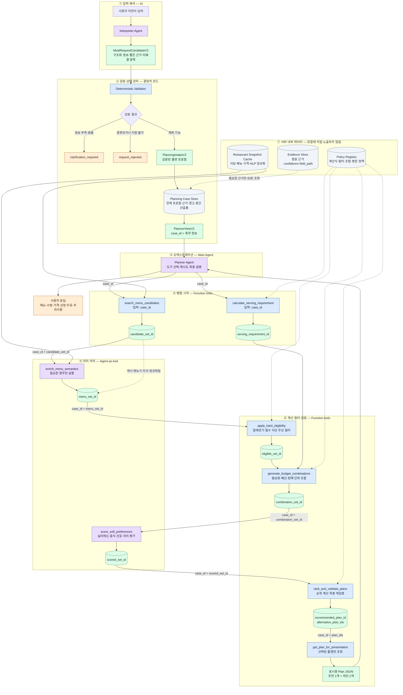

```mermaid
flowchart TD
    subgraph INPUT["① 입력·해석 — AI"]
        direction TB
        U["사용자 자연어 입력"]
        IA["Interpreter Agent"]
        CJ["MealRequestCandidateV2<br/>구조화 정보·짧은 근거·미해결 항목"]
        U --> IA --> CJ
    end

    subgraph VALIDATION["② 검증·상태 관리 — 결정적 코드"]
        direction TB
        DV["Deterministic Validator"]
        GD{"검증 결과"}
        CL["clarification_required"]
        RJ["request_rejected"]
        PI["PlanningIntakeV2<br/>검증된 불변 프로필"]
        CS[("Planning Case Store<br/>전체 프로필·근거·경고·중간 산출물")]
        PV["PlannerViewV2<br/>case_id + 축약 정보"]

        DV --> GD
        GD -->|"정보 부족·충돌"| CL
        GD -->|"잘못되거나 지원 불가"| RJ
        GD -->|"계획 가능"| PI
        PI --> CS --> PV
    end

    CJ --> DV

    subgraph ORCHESTRATOR["③ 오케스트레이션 — Main Agent"]
        PA["Planner Agent<br/>도구 선택·재시도·최종 설명"]
    end

    PV --> PA

    subgraph PARALLEL["④ 병렬 시작 — Function tools"]
        direction TB
        SR["calculate_serving_requirement<br/>입력: case_id"]
        MS["search_menu_candidates<br/>입력: case_id"]
        SRID[("serving_requirement_id")]
        CSID[("candidate_set_id")]

        SR --> SRID
        MS --> CSID
    end

    PA -->|"case_id"| SR
    PA -->|"case_id"| MS

    subgraph SEMANTIC["⑤ 의미 처리 — Agent-as-tool"]
        direction TB
        ME["enrich_menu_semantics<br/>필요한 경우만 실행"]
        MID[("menu_set_id")]
        SP["score_soft_preferences<br/>싫어하는 음식·선호 의미 평가"]
        SSID[("scored_set_id")]

        ME --> MID
        SP --> SSID
    end

    CSID -->|"case_id + candidate_set_id"| ME
    CSID -.->|"캐시 메뉴가 이미 정규화됨"| MID

    subgraph DETERMINISTIC["⑥ 계산·필터·검증 — Function tools"]
        direction TB
        HF["apply_hard_eligibility<br/>알레르기·필수 식단 우선 필터"]
        EID[("eligible_set_id")]

        GC["generate_budget_combinations<br/>필요량·예산·판매 단위 조합"]
        COID[("combination_set_id")]

        RV["rank_and_validate_plans<br/>순위 계산·최종 재검증"]
        PID[("recommended_plan_id<br/>alternative_plan_ids")]

        GP["get_plan_for_presentation<br/>선택된 플랜만 조회"]
        DISPLAY["표시용 Plan JSON<br/>추천 1개 + 대안 2개"]

        HF --> EID
        GC --> COID
        RV --> PID
        GP --> DISPLAY
    end

    MID -->|"case_id + menu_set_id"| HF
    EID --> GC
    SRID --> GC

    COID -->|"case_id + combination_set_id"| SP
    SSID -->|"case_id + scored_set_id"| RV
    PID -->|"case_id + plan_ids"| GP
    DISPLAY --> PA

    subgraph DATA["⑦ 서버 내부 데이터 — 모델에 직접 노출하지 않음"]
        direction TB
        RC[("Restaurant Snapshot Cache<br/>식당·메뉴·가격·NLP 정규화")]
        ES[("Evidence Store<br/>원문 근거·confidence·field_path")]
        PR[("Policy Registry<br/>계산식·필터·조합·랭킹 정책")]
    end

    RC --> MS
    RC --> ME
    ES -.->|"필요한 근거만 ID로 조회"| CS
    PR -.-> SR
    PR -.-> HF
    PR -.-> GC
    PR -.-> RV

    PA --> FINAL["사용자 응답<br/>메뉴·수량·가격·선정 이유·주의사항"]

    classDef ai fill:#eadcff,stroke:#7656a8,color:#241a33
    classDef deterministic fill:#dbeafe,stroke:#3b6ea8,color:#17243a
    classDef artifact fill:#dcfce7,stroke:#4d8a61,color:#183522
    classDef storage fill:#f1f5f9,stroke:#64748b,color:#1e293b
    classDef terminal fill:#ffedd5,stroke:#b56b26,color:#442510

    class IA,PA,ME,SP ai
    class DV,SR,MS,HF,GC,RV,GP deterministic
    class CJ,PI,PV,SRID,CSID,MID,EID,COID,SSID,PID,DISPLAY artifact
    class CS,RC,ES,PR storage
    class CL,RJ,FINAL terminal
```
